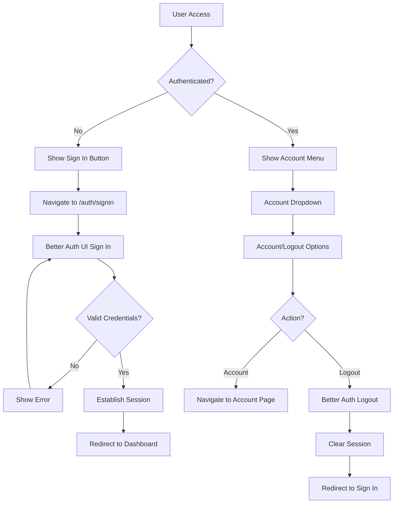
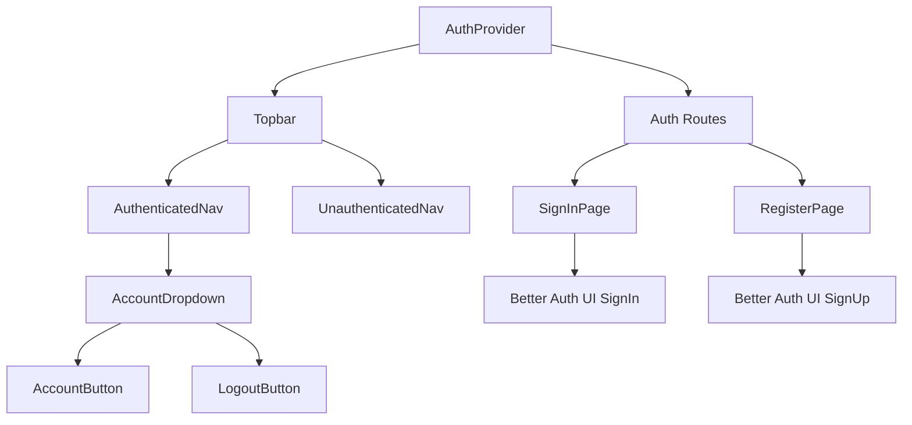

# Design Document

## Overview

The admin authentication system will integrate Better Auth with the existing admin application to provide secure user registration, sign-in, and session management. The design leverages the existing Better Auth UI components and integrates seamlessly with the current navigation structure using TanStack Router.

The system will enhance the existing Topbar component to show authentication state-aware navigation, replacing static buttons with dynamic authentication controls that respond to user session status.

## Architecture

### Authentication Flow


### Component Architecture


## Components and Interfaces

### 1. Enhanced Topbar Component
**Location:** `apps/admin/src/components/layout/Topbar.tsx`

The Topbar will be enhanced to show authentication-aware navigation:
- **Unauthenticated State:** Shows "Sign In" button
- **Authenticated State:** Shows account dropdown with user options

**Key Features:**
- Uses Better Auth's `useSession` hook to determine authentication state
- Renders different UI based on session status
- Integrates with existing sidebar trigger and settings

### 2. Authentication Navigation Components
**Location:** `apps/admin/src/components/auth/`

#### AuthenticatedNav Component
- Displays user account dropdown
- Shows "Account" and "Logout" options
- Handles logout functionality using Better Auth client

#### UnauthenticatedNav Component  
- Displays "Sign In" button
- Navigates to `/auth/signin` when clicked

#### AccountDropdown Component
- Dropdown menu for authenticated users
- Contains account management and logout options
- Uses existing UI components for consistency

### 3. Enhanced Auth Routes
**Existing Files:** 
- `apps/admin/src/routes/auth/signin.tsx`
- `apps/admin/src/routes/auth/register.tsx`

**Enhancements:**
- Add proper redirect handling for authenticated users
- Improve styling and layout consistency
- Add navigation links between signin and register pages
- Implement proper error handling and loading states

### 4. Authentication Hooks
**Location:** `apps/admin/src/hooks/useAuth.ts`

Custom hook that wraps Better Auth functionality:
- Provides authentication state
- Handles login/logout operations
- Manages session persistence
- Provides loading and error states

### 5. Route Protection
**Location:** `apps/admin/src/lib/routeGuards.ts`

Utility functions for protecting routes:
- Redirect unauthenticated users to sign-in
- Redirect authenticated users away from auth pages
- Handle session expiration

## Data Models

### User Session
```typescript
interface UserSession {
  id: string
  email: string
  name?: string
  createdAt: Date
  expiresAt: Date
}
```

### Authentication State
```typescript
interface AuthState {
  isAuthenticated: boolean
  user: UserSession | null
  isLoading: boolean
  error: string | null
}
```

### Navigation State
```typescript
interface NavigationAuthState {
  showSignIn: boolean
  showAccountMenu: boolean
  user: UserSession | null
}
```

## Error Handling

### Authentication Errors
- **Invalid Credentials:** Display user-friendly error message on sign-in form
- **Registration Conflicts:** Show specific error for existing email addresses
- **Network Errors:** Display retry options and fallback messaging
- **Session Expiration:** Automatically redirect to sign-in with informative message

### Navigation Errors
- **Route Protection:** Graceful redirects for unauthorized access attempts
- **State Synchronization:** Handle cases where auth state and navigation state become inconsistent

### Error Display Strategy
- Use Better Auth UI's built-in error handling for form validation
- Implement toast notifications for session-related errors
- Provide clear feedback for all user actions

## Security Considerations

### Session Management
- Leverage Better Auth's secure session handling
- Implement proper session expiration and renewal
- Use secure HTTP-only cookies for session storage

### Route Protection
- Implement client-side route guards for UX
- Ensure server-side validation for all protected endpoints
- Handle authentication state synchronization

### Input Validation
- Use Better Auth UI's built-in validation
- Implement additional client-side validation for UX
- Ensure proper sanitization of user inputs

### Error Information
- Avoid exposing sensitive information in error messages
- Log security events for monitoring
- Implement rate limiting for authentication attempts